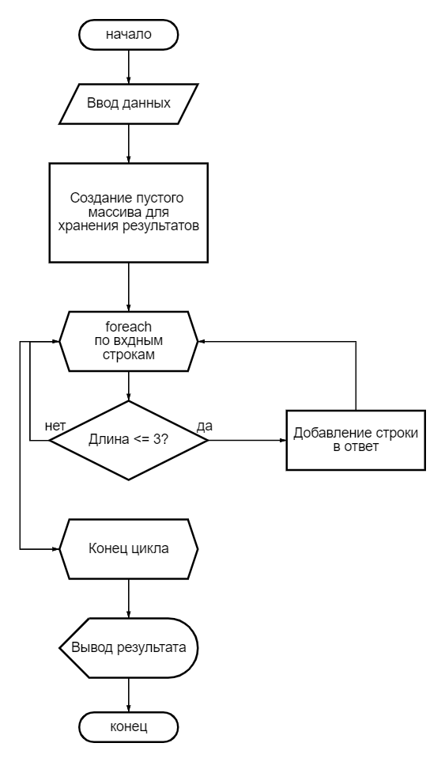

# FilterStrings

Программа на C#, которая фильтрует строки из массива, оставляя только те, у которых длина меньше или равна 3 символам.

## Использование

1. **Запуск приложения:**

    - Запустите программу в вашей среде разработки C# или используйте командную строку:
      ```bash
      dotnet run
      ```

2. **Ввод данных:**

    - Введите строки, разделенные пробелами, и нажмите Enter.

      Пример ввода:
      ```plaintext
      apple banana cat dog elephant fox
      ```

3. **Результат:**

    - Программа выведет отфильтрованный массив строк, где длина каждой строки меньше или равна 3 символам.

      Пример вывода:
      ```plaintext
      cat dog fox
      ```

## Диаграмма блок-схемы

